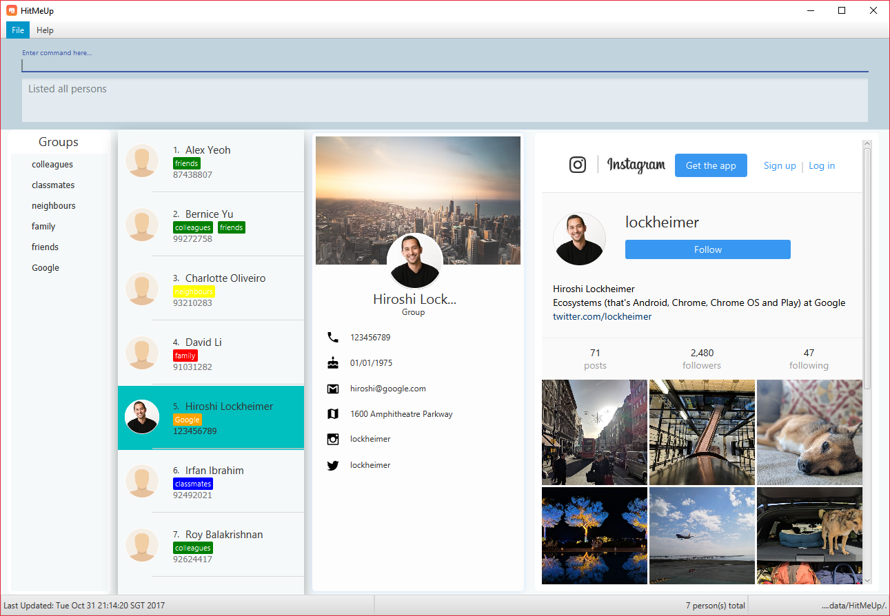

= HitMeUp
ifdef::env-github,env-browser[:relfileprefix: docs/]
ifdef::env-github,env-browser[:outfilesuffix: .adoc]

https://travis-ci.org/CS2103AUG2017-W14-B3/main[image:https://travis-ci.org/CS2103AUG2017-W14-B3/main.svg?branch=master[Build Status]]
https://ci.appveyor.com/project/danielbrzn/main[image:https://ci.appveyor.com/api/projects/status/5dietu4dyky37v1w?svg=true[Build status]]
https://coveralls.io/github/CS2103AUG2017-W14-B3/main?branch=master[image:https://coveralls.io/repos/github/CS2103AUG2017-W14-B3/main/badge.svg?branch=master[Coverage Status]]

ifdef::env-github[]

endif::[]

HitMeUp was designed with the sociable user in mind to provide a one stop solution for every need: To contact, keep up
and organise.
With the cloud import feature, a user is able to get the application
up and running a matter of minutes. Being able to group your contacts, and view each group at a glance affords
convenience like never before. Social integration to Instagram and Twitter is baked in, allowing users to view profiles
in the application itself without having to switch to a browser or check their phone.

== Features

====
*Since v1.5rc*

* View your contacts' addresses quickly in Google Maps
* Search by first letter of name
* Search by birthday month
* Automatically moves your contact's display pictures
* Easily access your groups by clicking on the tags in the `Groups` panel

====

====
*Key Features*

* Add a person with just their name and number
* Export individual contacts to easily share with others
* Search by groups and names
* A more compact view for the list of contacts, showing only the name/display picture/phone number
* Never forget a birthday again! Add birthdays to every contact
* Email contacts quickly without copying and pasting
* Import your contacts from Google Contacts
* Automatic list sorting
* Add pictures to every contact
* Add your contacts' Instagram/Twitter accounts
* View your groups at a glance with new groups tab
* New Material Design inspired UI, and an improved PersonCard
* Directly access your contacts' Instagram/Twitter accounts with the new *social* command

====

====
*Coming in v2.0*

* Multiple themes to suit your needs
* Secure your application with a PIN
* Import your contacts from Apple iCloud

====
== Site Map

* <<UserGuide#, User Guide>>
* <<DeveloperGuide#, Developer Guide>>
* <<AboutUs#, About Us>>
* <<ContactUs#, Contact Us>>

== Acknowledgements

* http://code.makery.ch/library/javafx-8-tutorial/[Java FX tutorial] by
_Marco Jakob_.

* https://developers.google.com/people/[Google People API]

== Licence : link:LICENSE[MIT]
