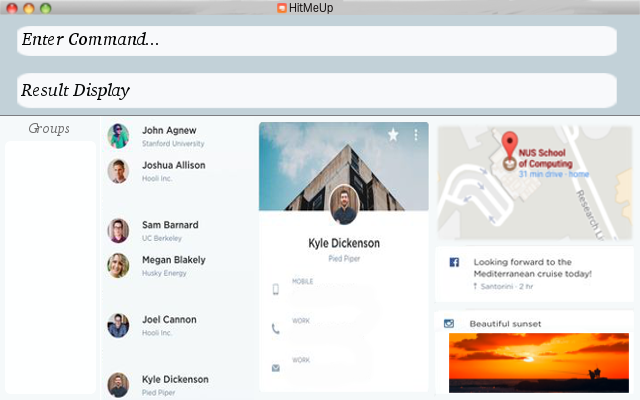

= HitMeUp
ifdef::env-github,env-browser[:relfileprefix: docs/]
ifdef::env-github,env-browser[:outfilesuffix: .adoc]

https://travis-ci.org/CS2103AUG2017-W14-B3/main[image:https://travis-ci.org/CS2103AUG2017-W14-B3/main.svg?branch=master[Build Status]]
https://ci.appveyor.com/project/danielbrzn/main[image:https://ci.appveyor.com/api/projects/status/5dietu4dyky37v1w?svg=true[Build status]]
https://coveralls.io/github/CS2103AUG2017-W14-B3/main?branch=master[image:https://coveralls.io/repos/github/CS2103AUG2017-W14-B3/main/badge.svg?branch=master[Coverage Status]]

ifdef::env-github[]

endif::[]

ifndef::env-github[]
image::images/AddressBookUi.png[width="600"]
endif::[]

== Features

====
*Since v1.2*

* Never forget a birthday again! Add birthdays to every contact
* Email contacts quickly without copying and pasting
* Import your contacts from Google Contacts/iCloud
* Automatic list sorting
====

====
*Coming in v2.0*

* Simply add a person with their name and number!
* Add pictures to every contact
* A powerful find command. Search by groups, keywords and more!
* View groups at a glance of the application
* Export individual contacts to easily share with others
* Easy access to social media profiles of each contact
* Multiple themes to suit your needs
* View your contacts' addresses quickly in Google Maps
* Secure your application with a PIN
====

== Site Map

* <<UserGuide#, User Guide>>
* <<DeveloperGuide#, Developer Guide>>
* <<LearningOutcomes#, Learning Outcomes>>
* <<AboutUs#, About Us>>
* <<ContactUs#, Contact Us>>

== Acknowledgements

* Some parts of this sample application were inspired by the excellent http://code.makery.ch/library/javafx-8-tutorial/[Java FX tutorial] by
_Marco Jakob_.

== Licence : link:LICENSE[MIT]
